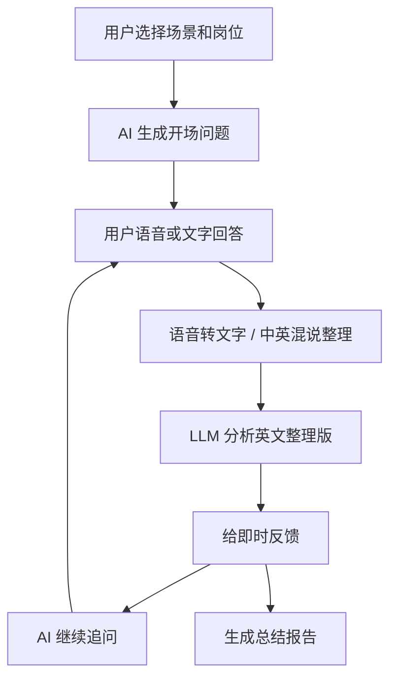

# PRD：职语 Coach

## 1. 产品一句话

一个帮助中国职场人练习英文面试、会议发言和职业自我介绍的 AI 口语陪练产品。

## 2. 目标用户

- 中国职场新人。
- 想进外企、跨境公司或国际团队的人。
- 已经学过英语，但真实开口时紧张、不知道怎么说的人。

## 3. 核心痛点

- 不敢开口，怕说错。
- 听不懂面试官或会议里的英文问题。
- 知道中文答案，但不知道怎么组织英文。
- 表达偏中式，不够自然。
- 发音不自信，缺少即时反馈。

## 4. MVP 范围

第一版只做 3 个高频场景：

- 英文面试。
- 英文会议发言。
- 职业自我介绍。

第一版只跑通一个闭环：

选择场景 -> AI 提问 -> 用户语音或文字回答 -> AI 追问 -> 生成反馈报告。

## 5. 核心功能

- 场景选择：面试、会议、自我介绍。
- 岗位选择：产品经理、程序员、运营、销售。
- 考官风格：初级私教、进阶教练、严厉考官。
- AI 角色扮演：模拟面试官或会议主持人。
- 语音输入：录音后转文字。
- AI 考官语音：用户可选择打开或关闭考官朗读。
- 文字输入：开发和演示时的保底输入方式。
- 中英混说辅助：用户回答里出现中文或中英混说时，先整理为自然英文，再交给 AI 考官评估。
- 即时反馈：结构、自然度、例子、职场表达。
- 总结报告：评分、优点、改进点、表达升级。
- 权限兜底：录音失败时，引导用户开启权限，并保留文字练习路径。

## 6. AI 工作流

## 7. 评估指标

产品指标：

- 开始练习率。
- 完成一轮练习率。
- 次日复练率。
- 用户是否愿意收藏报告。
- 用户是否愿意为更多场景付费。

AI 质量指标：

- 语音转文字准确率。
- 反馈是否具体。
- 中英混说整理是否保留原意。
- 追问是否贴合上一轮回答。
- 报告建议是否可执行。
- 响应延迟是否可接受。

## 8. 第一版商业假设

用户不是为“AI 聊天”付费，而是为“低压力、高频、具体场景的职场英语练习”付费。

更适合先从垂直场景切入：

- 外企英文面试。
- 跨境业务客户会议。
- 产品经理英文汇报。

## 8.1 盈利路径

第一阶段最适合卖“场景包”，不是一上来卖大会员。

- 免费层：每天 1 次基础陪练。
- 付费场景包：外企英文面试 7 天冲刺、产品经理英文面试专项、英文会议汇报专项。
- Pro 会员：无限练习、完整报告、历史记录、录音回放、个人词句本。
- 企业版：给出海公司、跨境电商、校招培训机构提供团队训练和岗位题库。

## 9. 面试作品集亮点

这个项目可以证明你具备 AI 产品经理的 6 个能力：

- 能定义真实用户和真实场景。
- 能把大模型能力拆成产品闭环。
- 能设计 Prompt 和多轮交互。
- 能考虑语音、延迟和成本。
- 能设计 AI 评估体系。
- 能用 MVP 快速验证商业假设。
